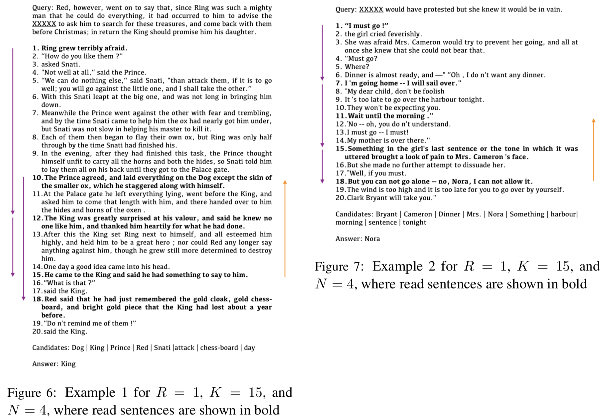
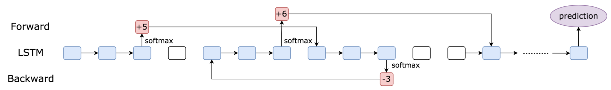

# [EMNLP'18 (long)] Speed Reading: Learning to Read ForBackward via Shuttle
A PyTorch implementation of LSTM-Shuttle

[Project](https://tsujuifu.github.io/projs/emnlp18_lstm-shuttle.html) | [Paper](https://tsujuifu.github.io/pubs/emnlp18_lstm-shuttle.pdf) | [Poster](https://raw.githubusercontent.com/tsujuifu/pytorch_lstm-shuttle/master/imgs/poster.jpg)

## Overview

LSTM-Shuttle not only reads shuttling forward but also goes back. Shuttling **forward enables high efficiency**, and going **backward gives the model a chance to recover lost information**, ensuring better prediction.

## This will be updated soon
